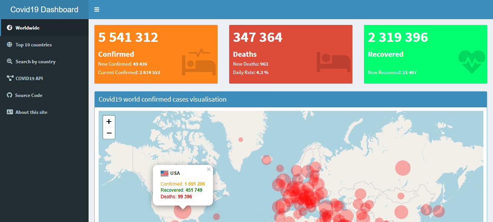

# covid19-dashboard
This's the source code for the [Covid19-dashboard](https://covid19dashboard.shinyapps.io/covid19App/), it's based on [the COVID-19 Data Analysis with R - Worldwide analysis report of the Novel Coronavirus](http://www.rdatamining.com/docs/Coronavirus-data-analysis-world.pdf).

The Data is sourced from [Worldometers](https://www.worldometers.info/coronavirus/).

You can find [here](https://covid19-api-access.herokuapp.com/) the Covid19-API.

# Shiny interface

# Resources
[Yanchang Zhao, COVID-19 Data Analysis with R – Worldwide. RDataMining.com, 2020](http://www.rdatamining.com/docs/Coronavirus-data-analysis-world.pdf)

[Worldometers](https://www.worldometers.info/coronavirus/)

# Contact
[chafiq.512@gmail.com](mailto:chafiq.512@gmail.com)

[khalil.dida01@gmail.com](mailto:khalil.dida01@gmail.com)
